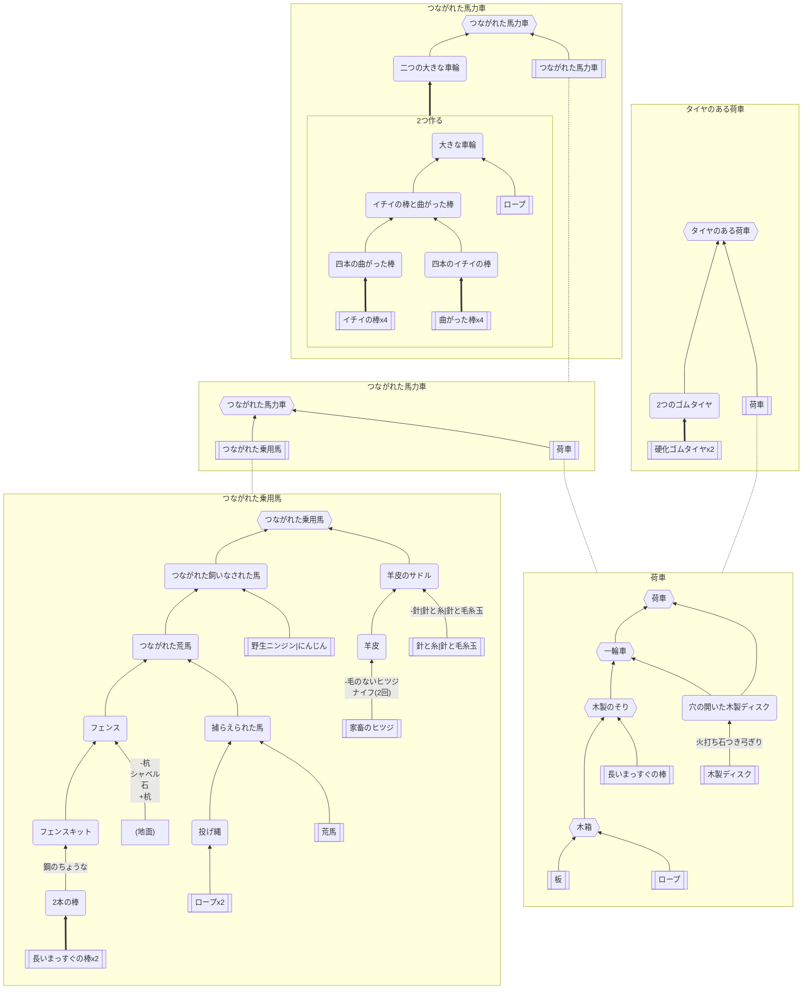

## 馬力車

### 必要なもの
* 長いまっすぐの棒
* 小さな曲がった棒
* イチイの棒
* ロープ
* 荒馬
* 家畜のヒツジ
* 板
* 木製ディスク
* [硬化ゴムタイヤ](https://github.com/aya-0p/yah-craft-recipe/blob/main/Rubber.md)

### 道具
* [鋼のちょうな、シャベル、ナイフ](https://github.com/aya-0p/yah-craft-recipe/blob/main/Iron.md)
* 火打ち石つき弓切り
* 杭
* 針と糸|針と毛糸玉
* 石
