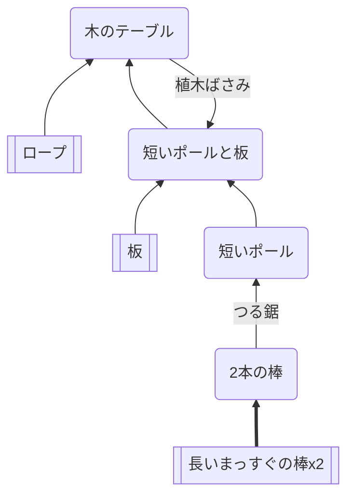

## 木のテーブル

```mermaid
flowchart BT
aa[[長いまっすぐの棒x2]]
ab[[板]]
ac[[ロープ]]
aa ==> ba(2本の棒)
ba -->|つる鋸| bb(短いポール)
bb --> bc(短いポールと板)
ab --> bc
bc --> bd(木のテーブル)
ac --> bd
bd -->|植木ばさみ| bc
```
### 必要なもの
* 長いまっすぐの棒
* 板
* ロープ
### 道具
* [つる鋸](https://github.com/aya-0p/yah-craft-recipe/blob/main/Iron.md)
