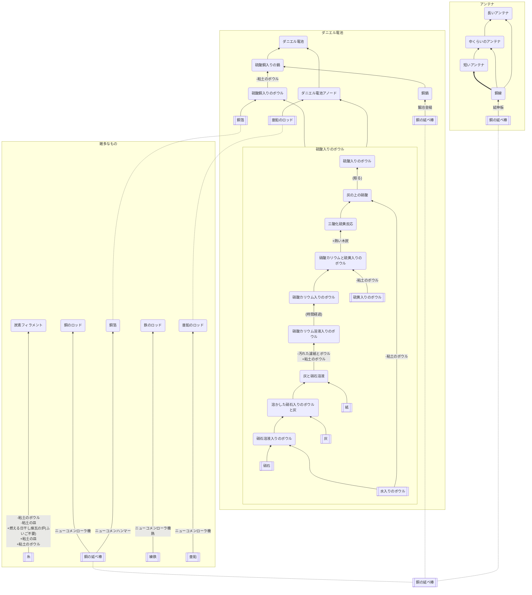

## AM送受信機/花火送信機/マルコーニレシーバー(部品)

### クラフト先
* [AM受信機](https://github.com/aya-0p/yah-craft-recipe/blob/main/AM-receiver.md)
* [AM送信機](https://github.com/aya-0p/yah-craft-recipe/blob/main/AM-transmitter.md)
* [マルコーニレシーバー](https://github.com/aya-0p/yah-craft-recipe/blob/main/Marconi-receiver.md)
* [花火送信機](https://github.com/aya-0p/yah-craft-recipe/blob/main/Marconi-transmitter.md)

### 必要なもの
* 銅の延べ棒
* 細工した鉄
* 糸
* 亜鉛
* 硝石
* 硫黄入りのボウル
* 水入りのボウル
* 紙
* 灰

### 道具
* 延伸板
* [土器系](https://github.com/aya-0p/yah-craft-recipe/blob/main/Cray.md)
* 鍛冶金槌
* ニューコメン系
