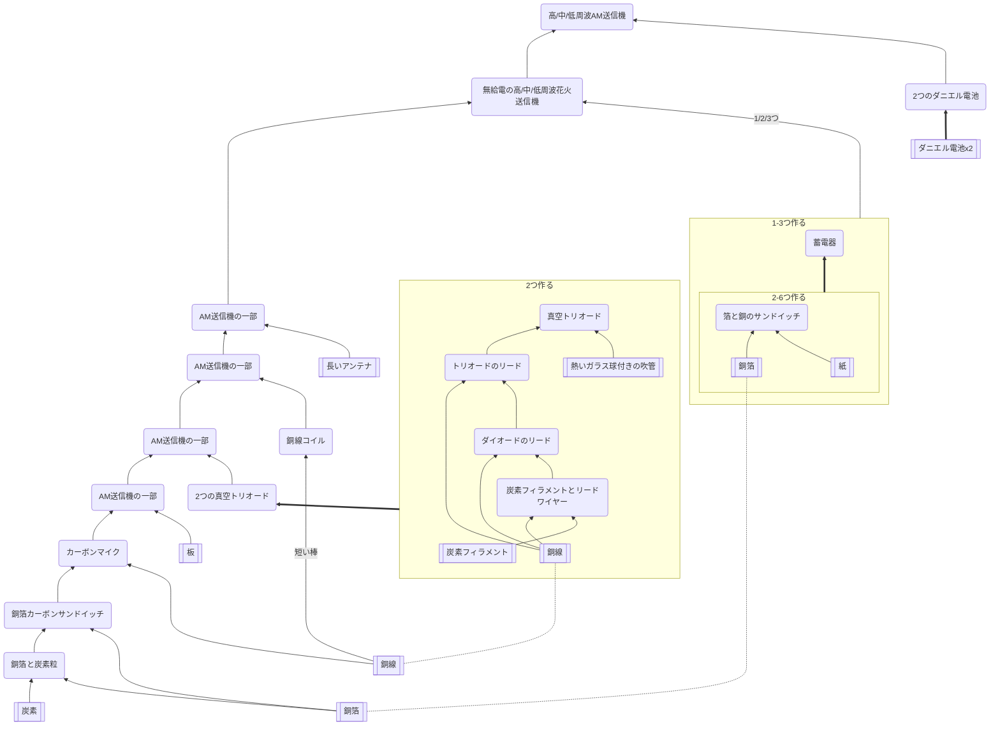

## 高/中/低周波AM送信機
**無給電の高/中/低周波花火送信機と誤表記があります**

### 必要なもの

### 道具

### 関連
* [AM受信機](https://github.com/aya-0p/yah-craft-recipe/blob/main/AM-receiver.md)
* [マルコーニレシーバー](https://github.com/aya-0p/yah-craft-recipe/blob/main/Marconi-receiver.md)
* [花火送信機](https://github.com/aya-0p/yah-craft-recipe/blob/main/Marconi-transmitter.md)
