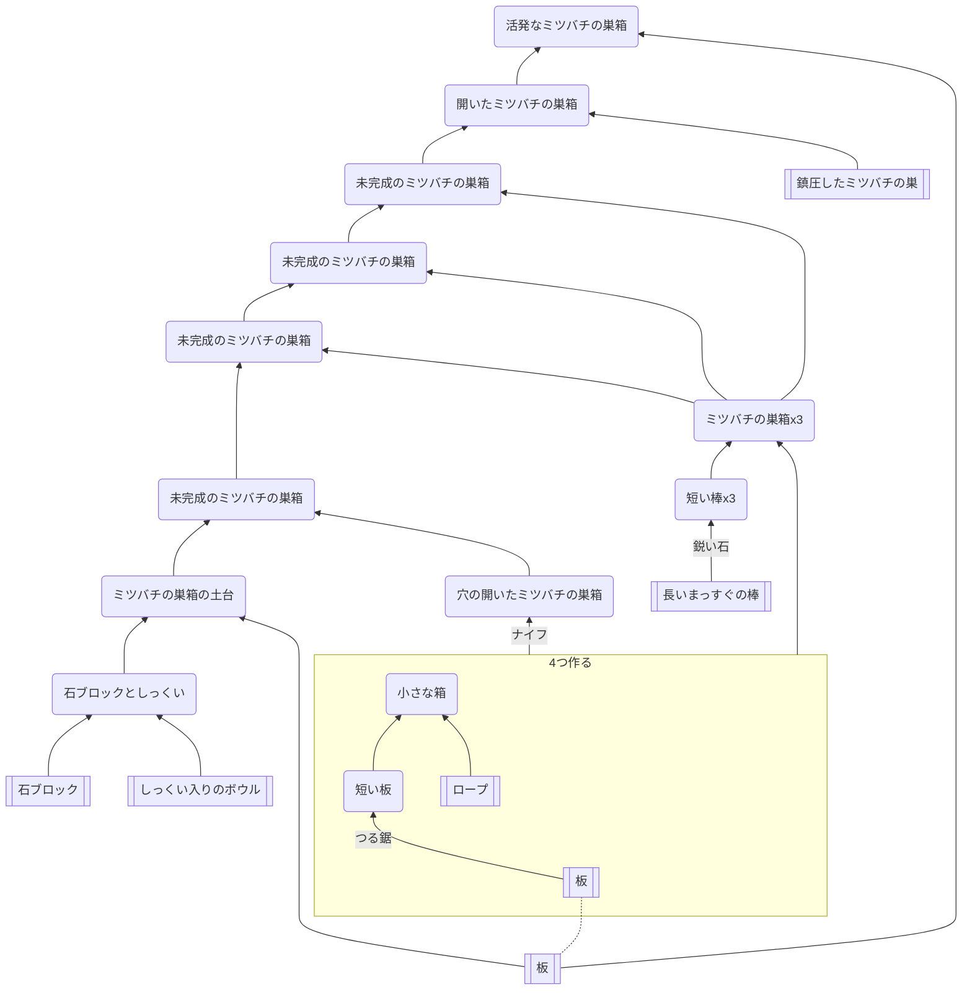

## ミツバチの巣箱

```mermaid
flowchart BT
aaa[[石ブロック]]
aab[[しっくい入りのボウル]]
aac[[板]]
aad[[長いまっすぐの棒]]
aae[[鎮圧したミツバチの巣]]

subgraph b [4つ作る]
direction BT
baa[[板]]
bab[[ロープ]]
baa -->|つる鋸| bba(短い板)
bba --> bbb(小さな箱)
bab --> bbb
end
aac -.- baa

aaa --> aba(石ブロックとしっくい)
aab --> aba
aba --> abb(ミツバチの巣箱の土台)
aac --> abb
b ---->|ナイフ| abc(穴の開いたミツバチの巣箱)
abb --> abd(未完成のミツバチの巣箱)
abc --> abd
b ------> abf(ミツバチの巣箱x3)
aad -->|鋭い石| abe(短い棒x3)
abe --> abf
abd --> abg(未完成のミツバチの巣箱)
abf --> abg
abg --> abh(未完成のミツバチの巣箱)
abf --> abh
abh --> abi(未完成のミツバチの巣箱)
abf --> abi
abi --> abj(開いたミツバチの巣箱)
aae --> abj
abj --> abk(活発なミツバチの巣箱)
aac --> abk
```
### 必要なもの
* 板
* ロープ
* 石ブロック
* しっくい入りのボウル
* 鎮圧したミツバチの巣
* 長いまっすぐの棒
### 道具
* つる鋸
* ナイフ
* 鋭い石
