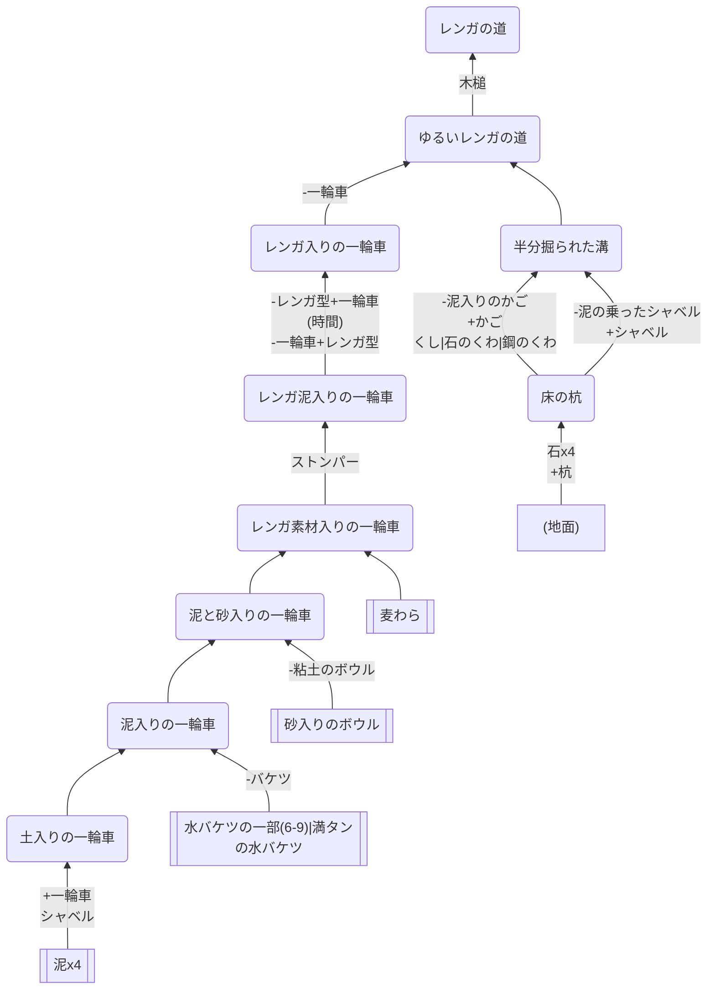

## テンプレート

```mermaid
flowchart BT
aaa[[泥x4]]
aab[["水バケツの一部(6-9)|満タンの水バケツ"]]
aac[[砂入りのボウル]]
aad[[麦わら]]

aaa -->|"+一輪車\nシャベル"| aba(土入りの一輪車)
aba --> abb(泥入りの一輪車)
aab -->|"-バケツ"| abb
abb --> abc(泥と砂入りの一輪車)
aac -->|"-粘土のボウル"| abc
abc --> abd(レンガ素材入りの一輪車)
aad --> abd
abd -->|ストンパー| abe(レンガ泥入りの一輪車)
abe -->|"-レンガ型+一輪車\n(時間)\n-一輪車+レンガ型"| abf(レンガ入りの一輪車)
abg["(地面)"] -->|"石x4\n+杭"| abh(床の杭)
abh -->|"-泥入りのかご\n+かご\nくし|石のくわ|鋼のくわ"| abi(半分掘られた溝)
abh -->|"-泥の乗ったシャベル\n+シャベル"| abi
abf -->|"-一輪車"| abj(ゆるいレンガの道)
abi --> abj
abj -->|木槌| abk(レンガの道)

```
### 必要なもの

### 道具
