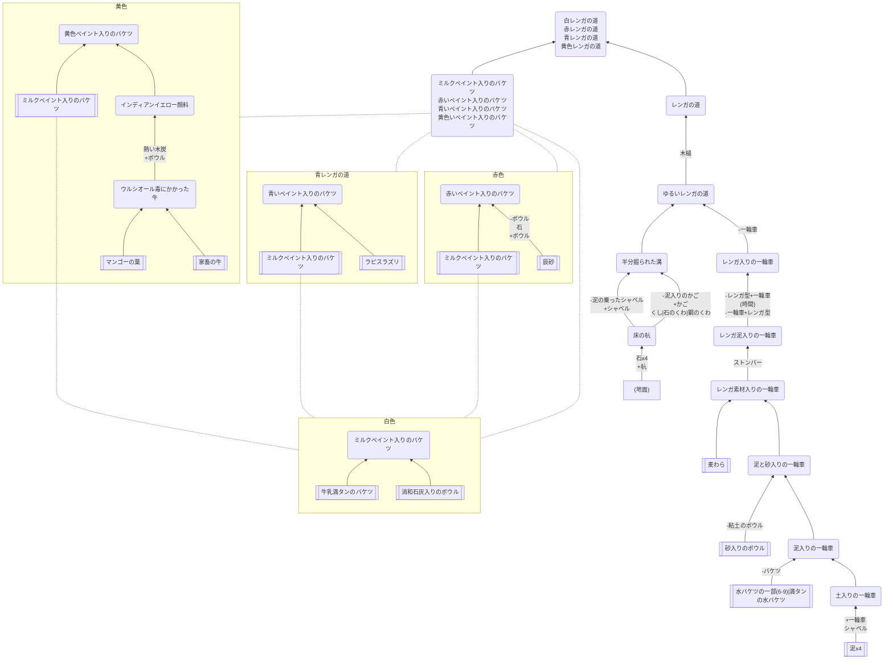

## レンガ

```mermaid
flowchart BT
aaa[[泥x4]]
aab[["水バケツの一部(6-9)|満タンの水バケツ"]]
aac[[砂入りのボウル]]
aad[[麦わら]]

aaa -->|"+一輪車\nシャベル"| aba(土入りの一輪車)
aba --> abb(泥入りの一輪車)
aab -->|"-バケツ"| abb
abb --> abc(泥と砂入りの一輪車)
aac -->|"-粘土のボウル"| abc
abc --> abd(レンガ素材入りの一輪車)
aad --> abd
abd -->|ストンパー| abe(レンガ泥入りの一輪車)
abe -->|"-レンガ型+一輪車\n(時間)\n-一輪車+レンガ型"| abf(レンガ入りの一輪車)
abg["(地面)"] -->|"石x4\n+杭"| abh(床の杭)
abh -->|"-泥入りのかご\n+かご\nくし|石のくわ|鋼のくわ"| abi(半分掘られた溝)
abh -->|"-泥の乗ったシャベル\n+シャベル"| abi
abf -->|"-一輪車"| abj(ゆるいレンガの道)
abi --> abj
abj -->|木槌| abk(レンガの道)

subgraph c [白色]
direction BT
caa[[牛乳満タンのバケツ]]
cab[[消和石灰入りのボウル]]
caa --> cb(ミルクペイント入りのバケツ)
cab --> cb
end

subgraph b [黄色]
direction BT
baa[[家畜の牛]]
bab[[マンゴーの葉]]
bac[[ミルクペイント入りのバケツ]]
baa --> bba(ウルシオール毒にかかった牛)
bab --> bba
bba -->|"熱い木炭\n+ボウル"| bbb(インディアンイエロー顔料)
bbb --> bbc(黄色ペイント入りのバケツ)
bac --> bbc
end
c -...- bac

subgraph d [赤色]
direction BT
daa[[辰砂]]
dab[[ミルクペイント入りのバケツ]]
daa -->|"-ボウル\n石\n+ボウル"| db(赤いペイント入りのバケツ)
dab --> db
end
c -...- dab

subgraph e [青レンガの道]
direction BT
eaa[[ラピスラズリ]]
eab[[ミルクペイント入りのバケツ]]
eaa --> eb(青いペイント入りのバケツ)
eab --> eb
end
c -...- eab

b -..- abl("ミルクペイント入りのバケツ\n赤いペイント入りのバケツ\n青いペイント入りのバケツ\n黄色いペイント入りのバケツ")
c -..- abl
d -..- abl
e -..- abl

abk --> abm("白レンガの道\n赤レンガの道\n青レンガの道\n黄色レンガの道")
abl --> abm
```
### 必要なもの
* 泥
* 水
* 砂
* 麦わら
* 牛乳満タンのバケツ
* 家畜の牛
* 消和石灰入りのボウル
* マンゴーの葉
* ラピスラズリ
* 辰砂
### 道具
* 一輪車
* シャベル
* 杭
* バケツ
* ボウル
* ストンパー
* 石
* 板
* くし|石のくわ|鋼のくわ
* かご
* 熱い木炭
