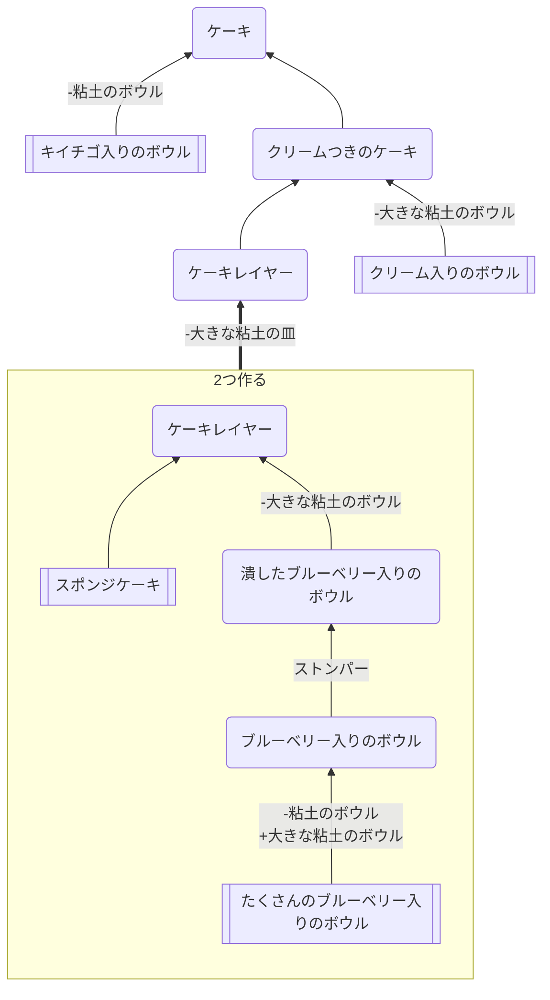

## ケーキ

### 必要なもの
* [スポンジケーキ](https://github.com/aya-0p/yah-craft-recipe/blob/main/Sponge-cake.md)
* [クリーム入りのボウル](https://github.com/aya-0p/yah-craft-recipe/blob/main/Cream.md)
* たくさんのブルーベリー入りのボウル
### 道具
* ストンパー
* [土器系](https://github.com/aya-0p/yah-craft-recipe/blob/main/Clay.md)
