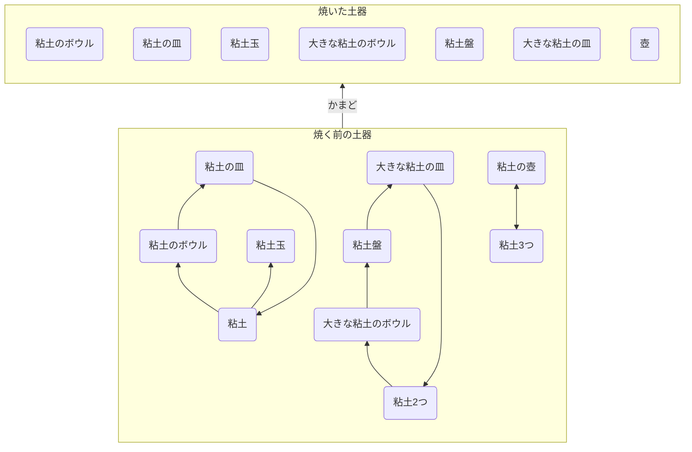

```mermaid
flowchart BT

subgraph a [焼く前の土器]
direction BT
aaa(粘土)
aab(粘土のボウル)
aac(粘土の皿)
aad(粘土玉)

aba(粘土2つ)
abb(大きな粘土のボウル)
abc(粘土盤)
abd(大きな粘土の皿)

aca(粘土3つ)
acb(粘土の壺)


aaa --> aab
aab --> aac
aac --> aaa
aaa --> aad

aba --> abb
abb --> abc
abc --> abd
abd --> aba

aca <--> acb
end

subgraph b [焼いた土器]
direction BT
ba(粘土のボウル)
bb(粘土の皿)
bc(粘土玉)
bd(大きな粘土のボウル)
be(粘土盤)
bf(大きな粘土の皿)
bg(壺)
end
a -->|"かまど"| b
```
