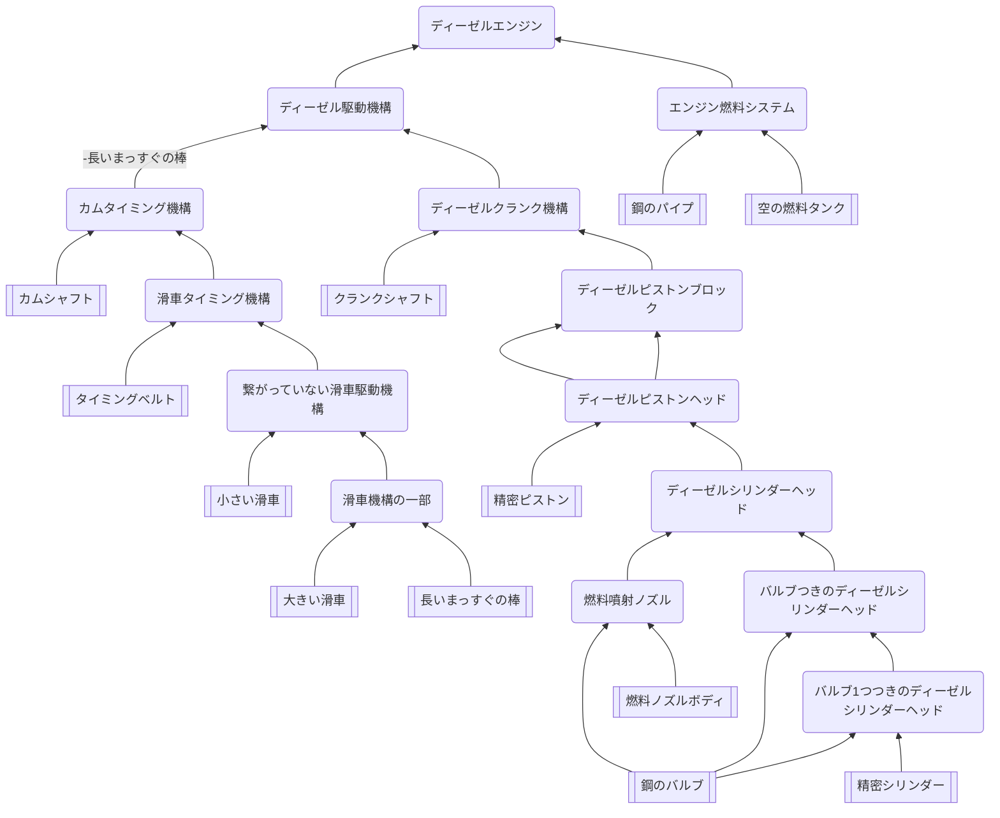

## エンジン(組み立て)

```mermaid
flowchart BT
aa[[鋼のパイプ]]
ab[[精密シリンダー]]
ac[[燃料ノズルボディ]]
ad[[鋼のバルブ]]
ae[[精密ピストン]]
af[[クランクシャフト]]
ag[[大きい滑車]]
ah[[小さい滑車]]
ai[[タイミングベルト]]
aj[[カムシャフト]]
ak[[長いまっすぐの棒]]
al[[空の燃料タンク]]

ad --> ba(バルブ1つつきのディーゼルシリンダーヘッド)
ab --> ba
ad --> bb(バルブつきのディーゼルシリンダーヘッド)
ba --> bb
ad --> bc(燃料噴射ノズル)
ac --> bc
bc --> bd(ディーゼルシリンダーヘッド)
bb --> bd
ae --> be(ディーゼルピストンヘッド)
bd --> be
be --> bf(ディーゼルピストンブロック)
be --> bf
af --> bg(ディーゼルクランク機構)
bf --> bg

ag --> bh(滑車機構の一部)
ak --> bh
ah --> bi(繋がっていない滑車駆動機構)
bh --> bi
ai --> bj(滑車タイミング機構)
bi --> bj
aj --> bk(カムタイミング機構)
bj --> bk
bk -->|"-長いまっすぐの棒"| bl(ディーゼル駆動機構)
bg --> bl
aa --> bn(エンジン燃料システム)
al --> bn
bl --> bm(ディーゼルエンジン)
bn --> bm
```
