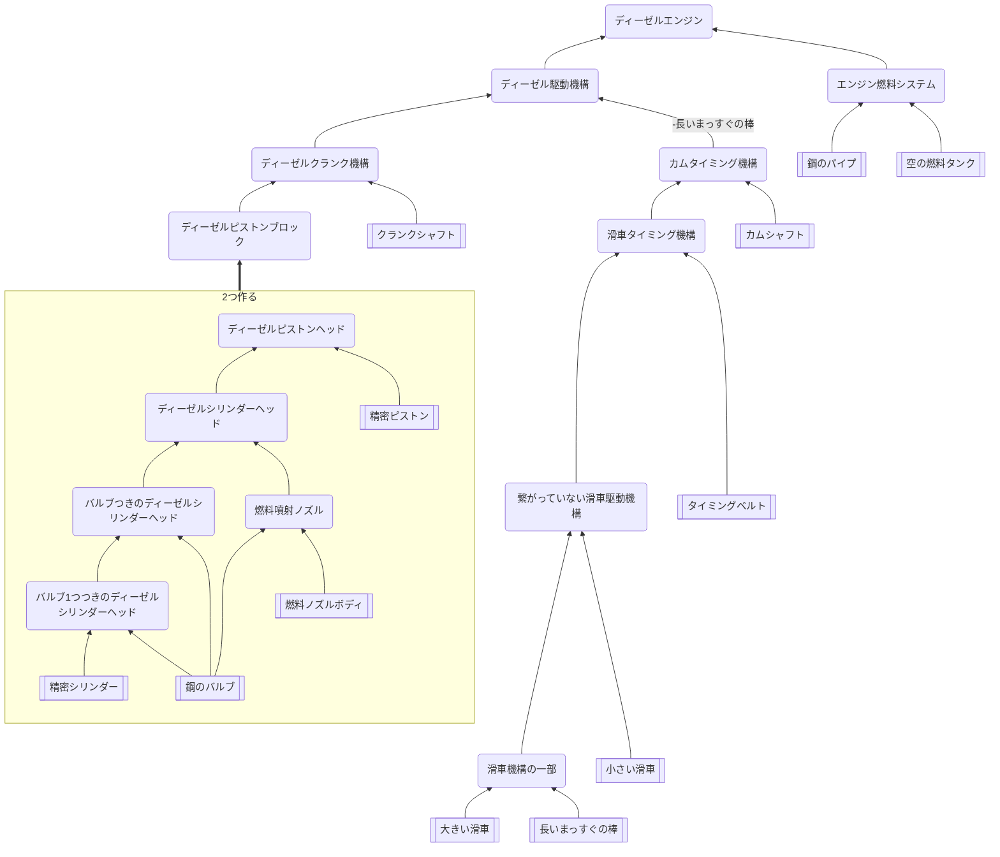

## エンジン(組み立て)

### クラフト先
* 車
* エンジン井戸
### 必要なもの
* [部品](https://github.com/aya-0p/yah-craft-recipe/blob/main/Engine-parts.md)
* [タイミングベルト](https://github.com/aya-0p/yah-craft-recipe/blob/main/Rubber.md)
* 長いまっすぐの棒
