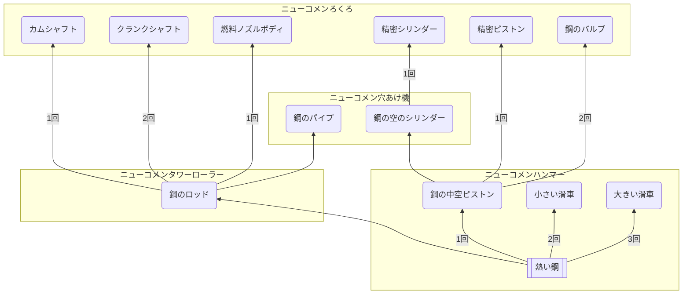

仮
## エンジン(部品)

```mermaid
flowchart BT
aa[[熱い鋼]]

subgraph ca [ニューコメンハンマー]
direction BT
aa -->|1回| be(鋼の中空ピストン)
aa -->|2回| bf(小さい滑車)
aa -->|3回| bg(大きい滑車)
end

subgraph cb [ニューコメンタワーローラー]
direction BT
aa --> ba(鋼のロッド)
end

subgraph cc [ニューコメン穴あけ機]
direction BT
ba --> bb(鋼のパイプ)
be --> bh(鋼の空のシリンダー)
end

subgraph cd [ニューコメンろくろ]
direction BT
ba -->|1回| bc(カムシャフト)
ba -->|2回| bd(クランクシャフト)
ba -->|1回| bj(燃料ノズルボディ)
bh -->|1回| bi(精密シリンダー)
be -->|1回| bk(精密ピストン)
be -->|2回| bl(鋼のバルブ)
end


```
### クラフト先
* [エンジン](https://github.com/aya-0p/yah-craft-recipe/blob/main/Engine-craft.md)
### 必要なもの
* 鋼
