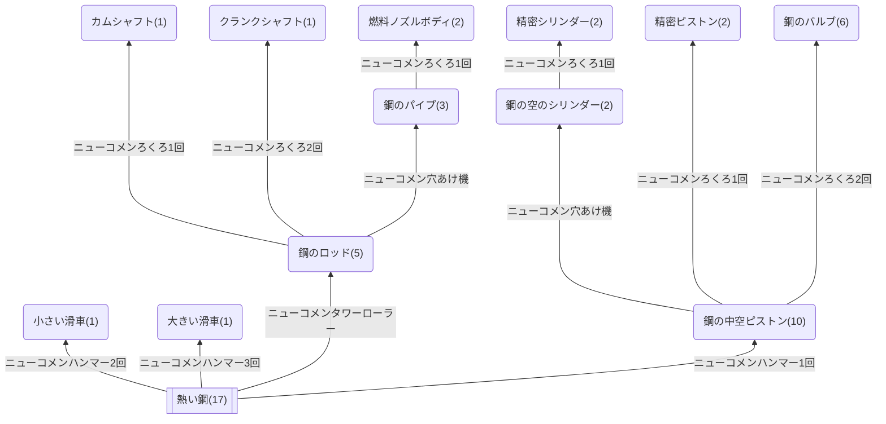

## エンジン(部品)
各数字はエンジンを作るのに必要な数

### クラフト先
* [エンジン](https://github.com/aya-0p/yah-craft-recipe/blob/main/Engine-craft.md)
### 必要なもの
* 鋼
### 道具
* [ニューコメン系](https://github.com/aya-0p/yah-craft-recipe/blob/main/Newcomen-tools.md)
