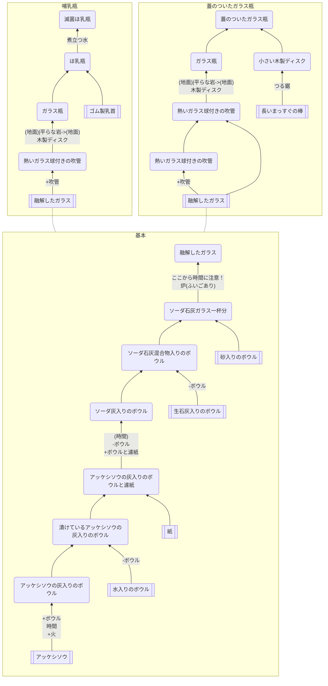

## ガラス

### クラフト先
* [コヒーラー -> マルコーニレシーバー](https://github.com/aya-0p/yah-craft-recipe/blob/main/AM-marconi-parts.md)
* [AM受信機](https://github.com/aya-0p/yah-craft-recipe/blob/main/AM-receiver.md)
* [AM送信機](https://github.com/aya-0p/yah-craft-recipe/blob/main/AM-transmitter.md)
* [マルコーニレシーバー](https://github.com/aya-0p/yah-craft-recipe/blob/main/Marconi-receiver.md)
### 必要なもの
* アッケシソウ
* 水
* 紙
* 生石灰入りのボウル
* 砂入りのボウル
* 長いまっすぐの棒
* ゴム製乳首
### 道具
* 火
* [ボウル](https://github.com/aya-0p/yah-craft-recipe/blob/main/Clay.md)
* 吹管
* 木製ディスク
* 炉
* つる鋸
* 煮立つ水
