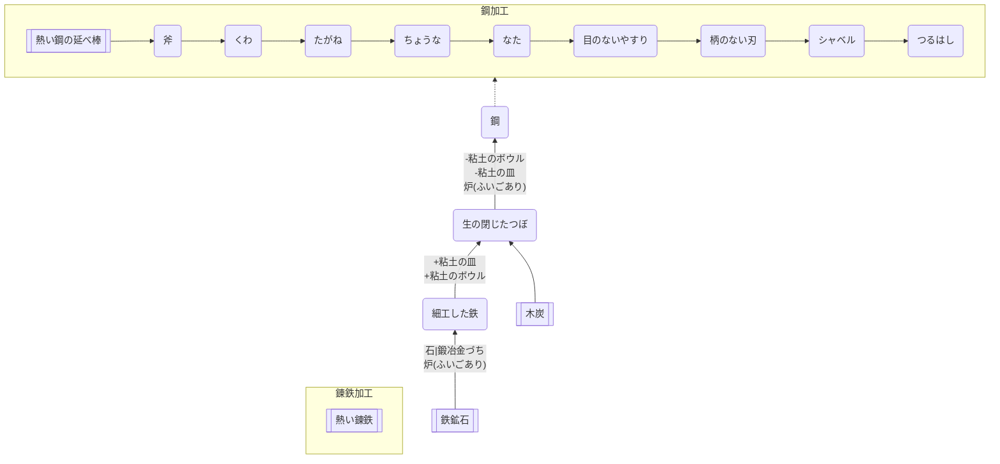

## 金属加工

```mermaid
flowchart BT
aaa[[鉄鉱石]]
aab[[木炭]]
aaa -->|"石|鍛冶金づち\n炉(ふいごあり)"| aba(細工した鉄)
aba -->|"+粘土の皿\n+粘土のボウル"| abb(生の閉じたつぼ)
aab --> abb
abb -->|"-粘土のボウル\n-粘土の皿\n炉(ふいごあり)"| abc(鋼)

subgraph b [鋼加工]
direction LR
ba[[熱い鋼の延べ棒]]
ba --> bba(斧)
bba --> bbb(くわ)
bbb --> bbc(たがね)
bbc --> bbd(ちょうな)
bbd --> bbe(なた)
bbe --> bbf(目のないやすり)
bbf --> bbg(柄のない刃)
bbg --> bbh(シャベル)
bbh --> bbi(つるはし)
end
abc -.-> b

subgraph c [錬鉄加工]
direction BT
ca[[熱い錬鉄]]
end
```
### 必要なもの
