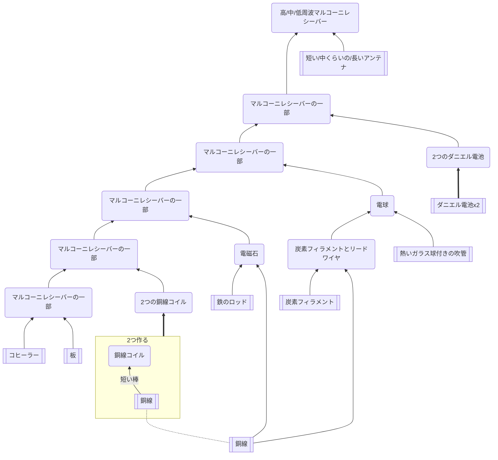

## 高/中/低周波マルコーニレシーバー

### 必要なもの

### 道具

### 関連
* [AM受信機](https://github.com/aya-0p/yah-craft-recipe/blob/main/AM-receiver.md)
* [AM送信機](https://github.com/aya-0p/yah-craft-recipe/blob/main/AM-transmitter.md)
* [花火送信機](https://github.com/aya-0p/yah-craft-recipe/blob/main/Marconi-transmitter.md)
