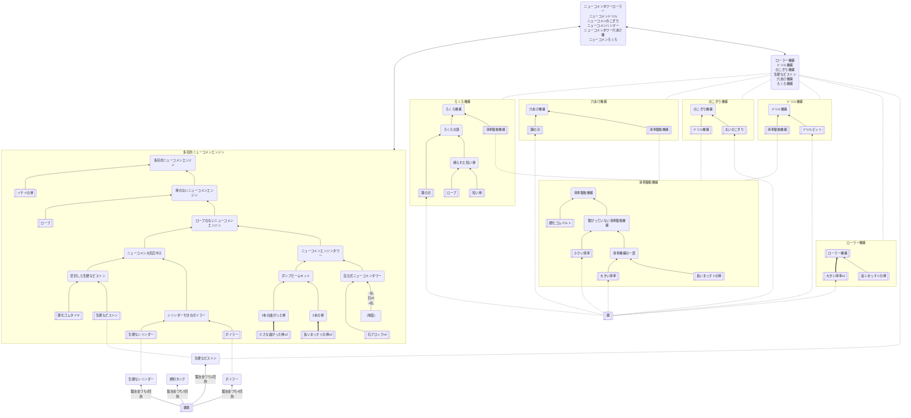

## ニューコメン系

### 必要なもの
* 石ブロック
* ロープ
* イチイの棒
* 小さな曲がった棒
* 長いまっすぐの棒
* [硬化ゴムタイヤ、硬化ゴムベルト](https://github.com/aya-0p/yah-craft-recipe/blob/main/Rubber.md)
* 鋼
* 錬鉄

### 道具
* [鍛冶金づち](https://github.com/aya-0p/yah-craft-recipe/blob/main/Iron.md)
* 石
* 杭
