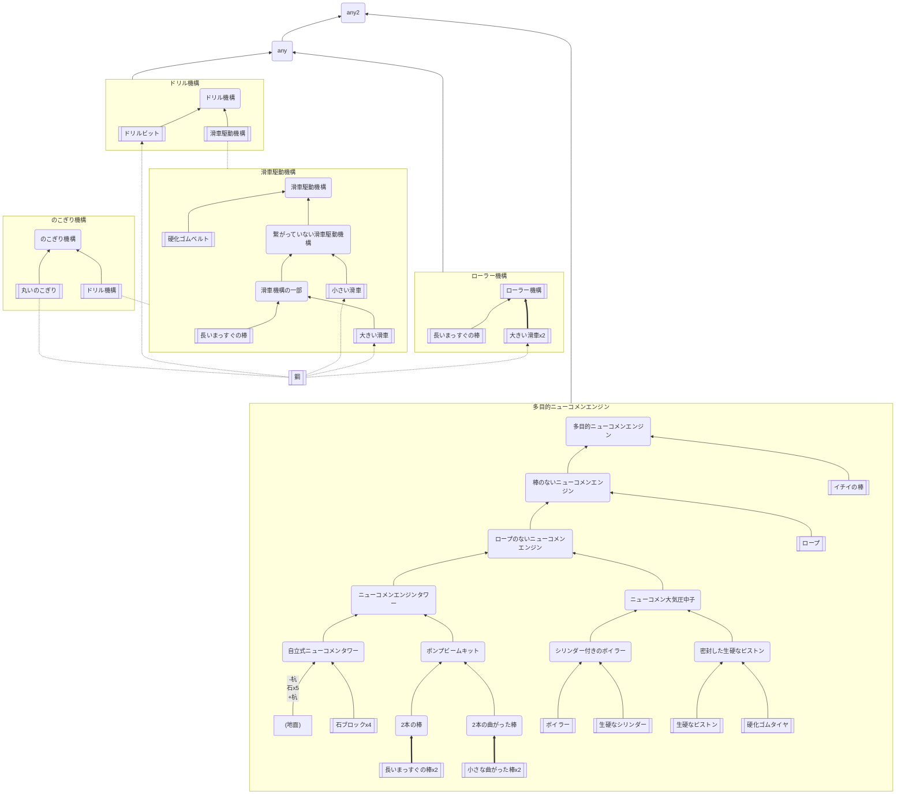

## ニューコメン系

```mermaid
flowchart BT
roota[[鋼]]

subgraph a [多目的ニューコメンエンジン]
direction BT
aaa[[石ブロックx4]]
aab[[長いまっすぐの棒x2]]
aac[[小さな曲がった棒x2]]
aad[[ボイラー]]
aae[[生硬なシリンダー]]
aaf[[生硬なピストン]]
aag[[硬化ゴムタイヤ]]
aah[[ロープ]]
aai[[イチイの棒]]


aba["(地面)"] -->|"-杭\n石x5\n+杭"| abb(自立式ニューコメンタワー)
aaa --> abb
aab ==> abc(2本の棒)
aac ==> abd(2本の曲がった棒)
abc --> abe(ポンプビームキット)
abd --> abe
abb --> abf(ニューコメンエンジンタワー)
abe --> abf
aad --> abg(シリンダー付きのボイラー)
aae --> abg
aaf --> abh(密封した生硬なピストン)
aag --> abh
abg --> abi(ニューコメン大気圧中子)
abh --> abi
abf --> abj(ロープのないニューコメンエンジン)
abi --> abj
abj --> abk(棒のないニューコメンエンジン)
aah --> abk
abk --> abl(多目的ニューコメンエンジン)
aai --> abl
end

subgraph b [ローラー機構]
direction BT
baa[[長いまっすぐの棒]]
bab[[大きい滑車x2]]
baa --> bba[[ローラー機構]]
bab ==> bba
end
roota -.-> bab
subgraph c [滑車駆動機構]
direction BT
caa[[長いまっすぐの棒]]
cab[[大きい滑車]]
cac[[小さい滑車]]
cad[[硬化ゴムベルト]]

caa --> cba(滑車機構の一部)
cab --> cba
cba --> cbb(繋がっていない滑車駆動機構)
cac --> cbb
cbb --> cbc(滑車駆動機構)
cad --> cbc
end
roota -.-> cab
roota -.-> cac

subgraph d [ドリル機構]
direction BT
ca[[ドリルビット]]
cb[[滑車駆動機構]]
cb --> db(ドリル機構)
ca --> db
end
roota -.-> ca
c -....- cb

subgraph e [のこぎり機構]
direction BT
eaa[[ドリル機構]]
eab[[丸いのこぎり]]
eaa --> eb(のこぎり機構)
eab --> eb
end
roota -.- eab
c -.- eaa


b ----> topa(any)
d ---> topa

topa --> topb(any2)
a ----------> topb
```
### 必要なもの

### 道具
