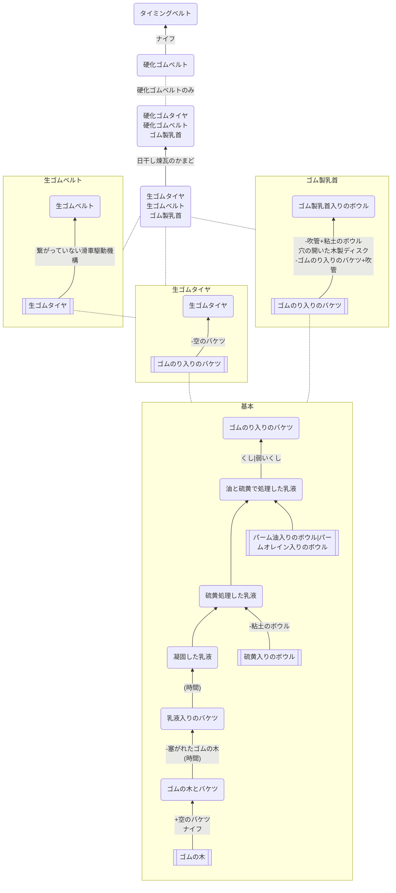

## ゴム

### クラフト先
* [エンジン](https://github.com/aya-0p/yah-craft-recipe/blob/main/Engine-craft.md)
* [ほ乳瓶](https://github.com/aya-0p/yah-craft-recipe/blob/main/Glass.md)
* [ニューコメンエンジン、滑車駆動機構](https://github.com/aya-0p/yah-craft-recipe/blob/main/Newcomen-tools.md)
* 荒い車
* [タイヤのある荷車](https://github.com/aya-0p/yah-craft-recipe/blob/main/2.23.0/Horse-drawn-cart.md)
* [小さい一輪車](https://github.com/aya-0p/yah-craft-recipe/blob/main/Wheelbarrow.md)
### 必要なもの
* ゴムの木
* 硫黄入りのボウル
* パーム油入りのボウル|パームオレイン入りのボウル
### 道具
* [粘土のボウル](https://github.com/aya-0p/yah-craft-recipe/blob/main/Clay.md)
* くし|弱いくし
* ナイフ
* 空のバケツ
