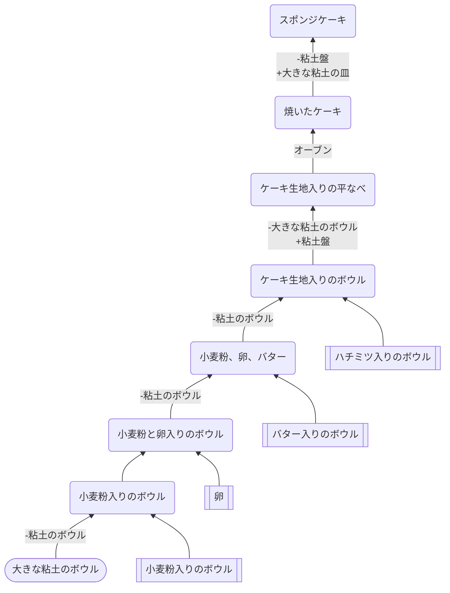

## スポンジケーキ

### クラフト先
* [ケーキ](https://github.com/aya-0p/yah-craft-recipe/blob/main/Cake.md)
### 必要なもの
* 小麦粉入りのボウル
* 卵: 池から入手
* バター入りのボウル
* ハチミツ入りのボウル
### 道具
* オーブン
* [土器系](https://github.com/aya-0p/yah-craft-recipe/blob/main/Cray.md)
