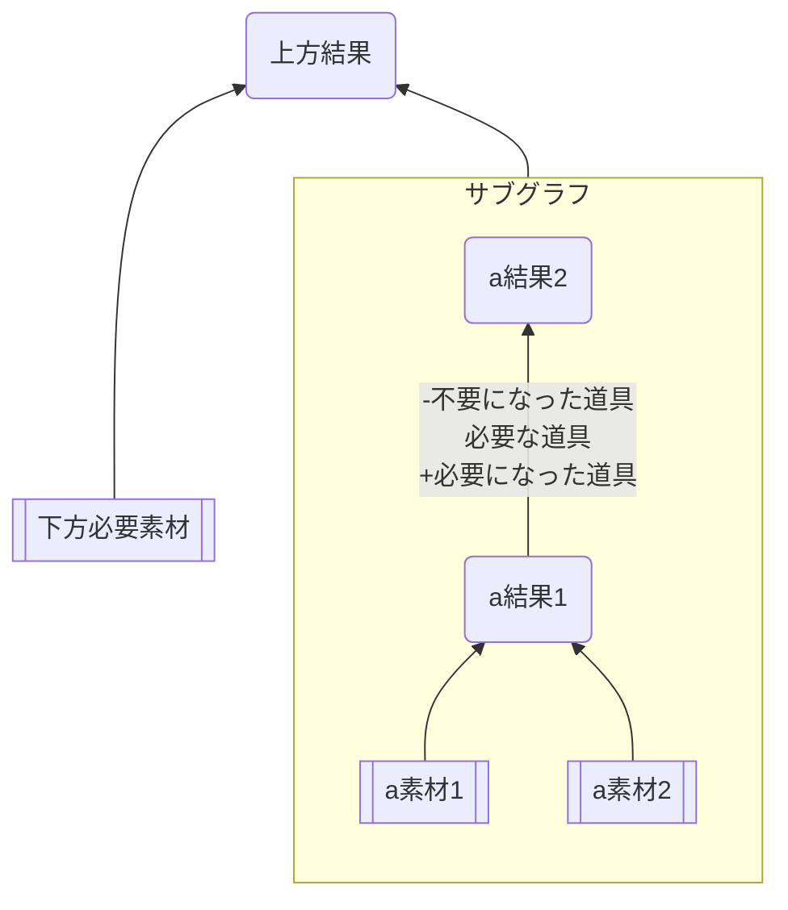

## テンプレート

```mermaid
flowchart BT
roota[[下方必要素材]]
subgraph a [サブグラフ]
direction BT
aaa[[a素材1]]
aab[[a素材2]]
aaa --> aba(a結果1)
aab --> aba
aba -->|"-不要になった道具\n必要な道具\n+必要になった道具"| abb(a結果2)
end
roota --> topa(上方結果)
a --> topa
```
##### mermaid作成上の注意
* 基本は下から上(BT)
* idは3桁構成(αβγ)
> α: 枠別(枠なしで省略可)  
> β: 種類, a: 素材, b: クラフト結果  
> γ: 連番, a,b,c...
* subgraphは枠のみ
### クラフト先

### 必要なもの

### 道具

### 関連
