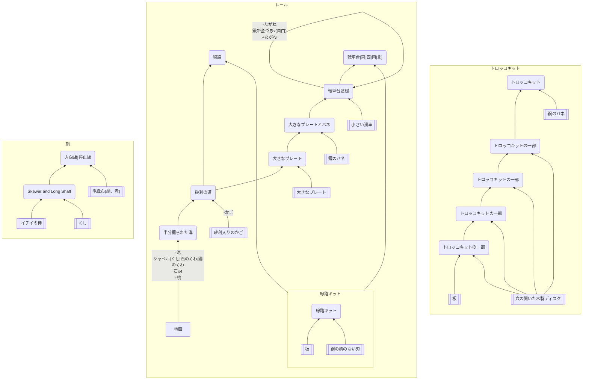

## トロッコとレール

### 必要なもの
* 板
* 穴の開いた木製ディスク
* [鋼のバネ、柄のない刃](https://github.com/aya-0p/yah-craft-recipe/blob/main/Iron.md)
* 砂利入りのかご
* 大きなプレート
* [小さい滑車](https://github.com/aya-0p/yah-craft-recipe/blob/main/Engine-parts.md)
* イチイの棒
* くし
* 毛織布
### 道具
* [シャベル、鋼のくわ、たがね、鍛冶金づち](https://github.com/aya-0p/yah-craft-recipe/blob/main/Iron.md)
* くし
* 石のくわ
* 杭
