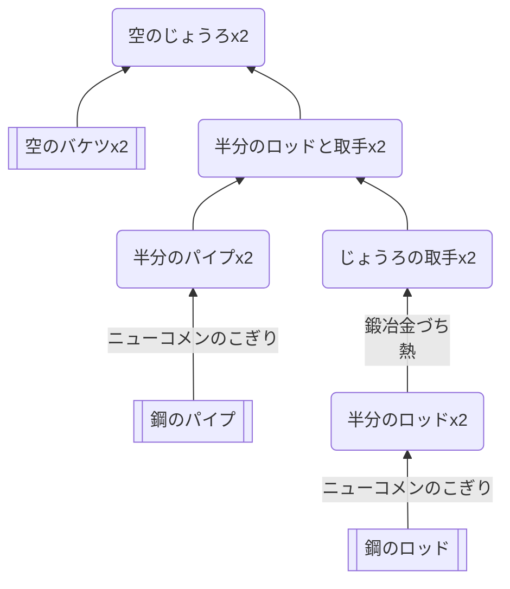

## テンプレート

### 必要なもの
* [鋼のロッド、鋼のパイプ](https://github.com/aya-0p/yah-craft-recipe/blob/main/Engine-parts.md)
* 空のバケツ
### 道具
* [ニューコメンのこぎり](https://github.com/aya-0p/yah-craft-recipe/blob/main/Newcomen-tools.md)
* 鍛冶金づち
