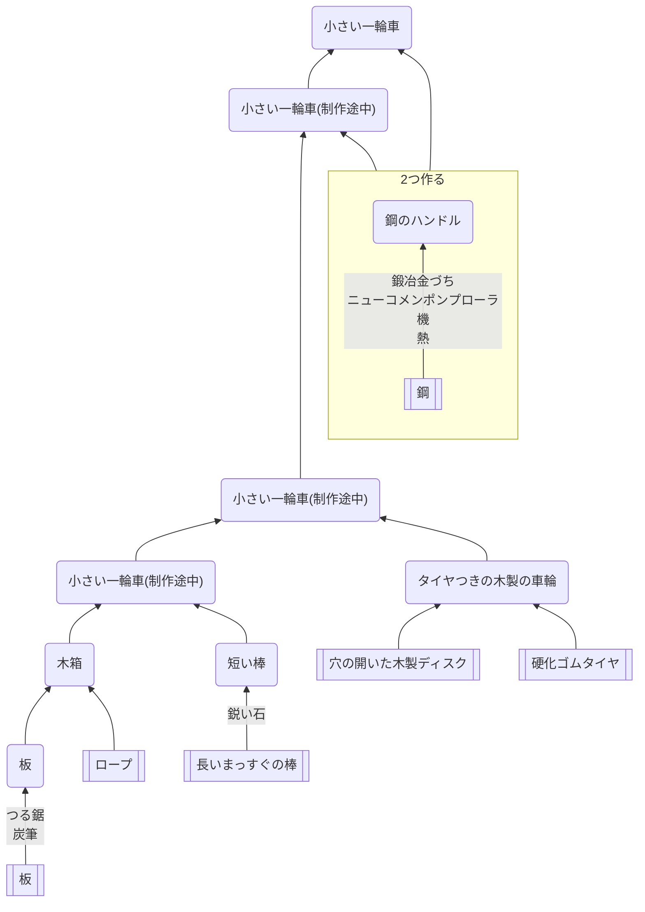

## 小さい一輪車

```mermaid
flowchart BT
aaa[[板]]
aab[[ロープ]]
aac[[長いまっすぐの棒]]
aad[[穴の開いた木製ディスク]]
aae[[硬化ゴムタイヤ]]

aaa -->|"つる鋸\n炭筆"| aba(板)
aba --> abb(木箱)
aab --> abb
aac -->|鋭い石| abc(短い棒)
abb --> abd("小さい一輪車(制作途中)")
abc --> abd
aad --> abe(タイヤつきの木製の車輪)
aae --> abe
abd --> abf("小さい一輪車(制作途中)")
abe --> abf
subgraph b [2つ作る]
direction BT
ba[[鋼]]
ba -->|"鍛冶金づち\nニューコメンポンプローラ機\n熱"| bb(鋼のハンドル)
end
abf ---> abg("小さい一輪車(制作途中)")
b --> abg
abg --> abh("小さい一輪車")
b --> abh
```
### 必要なもの
* 板
* 長いまっすぐの棒
* 穴の開いた木製ディスク
* [硬化ゴムタイヤ](https://github.com/aya-0p/yah-craft-recipe/blob/main/Rubber.md)
* 鋼
### 道具
* 炭筆
* つる鋸
* 鍛冶金づち
* 鋭い石
